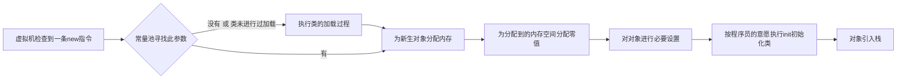

## 运行时数据区域

Java虚拟机在执行Java程序时会将其所管理的内存划分为若干个不同的数据区域，各个区域都有各自的用途，创建和销毁时间，具体如下图所示：


### 线程独立区域

#### 程序计数器

程序计数器是一块比较小的内存空间，可以看作是**当前线程所执行字节码的行号指示器。**

程序计数器的**生命周期**随着线程，线程启动而产生，线程结束而消亡

> 在虚拟机的**概念模型**中，**字节码解释器**通过改变程序计数器的值选取下一条要执行的字节码指令。
>
> **分支，循环，跳转，异常处理，线程恢复等基础功能**都依赖这个计数器完成。

每个线程都有其独立的**程序计数器**！

为什么每个线程都拥有其独立的程序计数器？

> 当线程执行一个Java方法时，这个计数器记录的是正在执行的虚拟机字节码**指令地址**。
>
> 由于Java虚拟机的多线程是通过线程轮流切换，分配处理器执行时间的方式实现的，也就表示**任意一个时刻，一个处理器都只会执行一条线程中的指令**。
>
> 为了**线程切换后能恢复到正确的执行位置**，所以每个线程都需要拥有自己独立的程序计数器。

线程执行Java方法时，计数器记录的是正在执行的虚拟机字节码**指令地址**；执行native方法时，计数器值为空。

#### Java虚拟机栈

Java虚拟机栈描述的是**Java方法执行的内存模型**。

> 每个Java方法在执行期间都会创建一个栈帧，用于存放局部变量，操作数栈（操作数），动态连接，方法出口等信息。
>
> **每个Java方法调用开始，知道执行完成的过程中，就对应着一个栈帧从虚拟机的栈中入栈到出栈的过程。**

Java虚拟机栈也是**线程私有**的，其**生命周期**同样随着线程启动而生，线程结束消亡。

> 很多人将Java内存分为：**堆内存和栈内存**，这里的栈内存就指的是Java虚拟机栈，或是Java虚拟机栈中局部变量表的部分。
>
> **局部变量表：**存放了编译期可知的各种基本类型：boolean、byte、char、short、...、对象引用（不是对象本身，可能是一个指向对象起始地址的引用指针或一个代表对象的句柄等）
>
> * 这其中，long和double类型的数据占**2个**局部变量空间，其余类型仅占**1个**。
> * **局部变量表的内存空间**在**编译期间**完成分配，一个方法运行期间需要在帧中分配多大的局部变量空间是完全确定的，运行期间不会修改局部变量表大小。

Java虚拟机规范中，对该区域规定了**两种**异常情况：

* ```StackOverflowError```：线程请求的栈深度大于虚拟机所允许的深度；
* ```OutOfMenmoryError```：如果虚拟机栈可以动态扩展（大部分都可以），当扩展时无法申请到足够内存时抛出；

#### 本地方法栈

本地方法栈与Java虚拟机栈作用基本类似，区别在于Java虚拟机栈执行Java方法服务，而本地方法栈执行Native方法服务。

同Java虚拟机栈，其也有同样的两种异常情况，这里不再赘述。

### 线程共享区域

#### Java堆

> 一般情况下，对大多数应用来说，Java堆是Java虚拟机管理内存中的**最大**一块。

Java堆是被**所有线程共享**的一块其余，**生命周期**在虚拟机启动时创建，随虚拟机关闭消亡。

Java堆**唯一作用**就是存放对象实例。

> 理论上来讲，**所有对象的实例及数组都要在堆上分配**。

Java堆是**垃圾收集器管理的主要区域**，也被称作GC堆。

Java堆可以处于**物理上不连续的内存空间中**，只要逻辑上是连续的即可。

Java虚拟机规范中，对该区域规定了**一种**异常情况：

* ```OutOfMemoryError```：对象在队中未完成实例的分配，同时堆也无法再扩展，抛出该异常。

#### 方法区

同Java堆一样，方法去也是**所有线程共享**的内存区域。

方法区**作用**为：存储已经被虚拟机加载的**类，常量，静态变量，即时编译器编译后的代码等数据**，也称非堆。

Java虚拟机规范中，对该区域规定了**一种**异常情况：

* ```OutOfMemoryError```：方法区无法满足内存分配需求时，同时无法再扩展，抛出该异常。

##### 运行时常量池

运行时常量池是**方法区的一部分**。

> Class文件除了有类的版本，字段，方法，接口等描述信息外，还有一项是常量池，用于**存放编译期间生成的各种字面量和符号引用**，此部分在类加载后进入方法区运行时常量池。

Java虚拟机规范中，对该区域规定了**一种**异常情况：

* ```OutOfMemoryError```：运行时常量池无法满足内存分配需求时，同时无法再扩展，抛出该异常。

### 直接内存

直接内存并不是Java虚拟机规范中定义的一部分，但这部分频繁的被使用，也很可能导致```OutOfMemoryError```异常的出现。

> JDK1.4引入NIO从而可以使用Native函数库直接分配堆外内存，通过一个存储在Java堆中的```DirectByteBuffer```对象作为这块内存的引用，避免在Java堆和Native堆之间来回复制数据。

实际使用中，虽然直接内存不会受到Java堆大小的限制，但仍会受到本机总内存大小和处理器寻址空间的限制，如果各个内存区域总和大于物理内存限制，就容易导致```OutOfMemoryError```异常的出现。

## HotSpot虚拟机对象

### 对象的创建

对象的创建过程如下图所示：



> 对上图进行几点说明：
>
> * 对象所需内存大小在**类加载完后**便可确定，为对象分配内存空间的任务=将**一块确定大小的内存区域从Java堆中划分出来**。
>   * 这里要特殊说明：分配方式有两种情况：
>     * **指针碰撞**：如果Java堆内存是绝对规整的，即完整的分为两个部分：已使用和未使用，则仅需要将中间的**一个指针**作为两部分的分界，将指针向未使用部分移动一段对象大小的距离即可。这种方式**需要垃圾收集器GC带有压缩整理（Compact过程）才能实现。**
>     * **空闲列表：**如果Java内存相互交错，就要采用此类方式，虚拟机需要维护一个列表，从列表中选取一个足够大的空间划分给对象实例。
> * 为对象分配内存的过程中有一个问题，在并发量高时，很可能出现以下情况：
>   * 在给对象A分配内存，但指针没来得及修改。此时对象B又使用了原来的指针分配内存
>   * **解决方案有两种：**
>     * **堆分配内存空间的动作进行同步处理——CAS配合失败重试**
>       * 
>     * **TLAB：**本地线程分配缓冲，即每个线程在Java堆中预先分配一块内存，将内存分配的动作按线程分配在不同空间内执行，哪个线程需要分配内存，就在哪个线程的TLAB上分配，只有当TLAB用完并且分配新的TLAB时才需要同步锁定。
> * 对对象必要设置：设置对象是哪个类的实例，如何找到类的元数据信息，对象的哈希码，对象的GC分代年龄等信息，并存入到对象的对象头中。

### 对象的内存布局

Java虚拟机中，对象在内存中的存储布局主要分为3块区域:**对象头，实例数据，对其填充**

#### 对象头：

对象头一般存储两类信息：**对象自身的运行时数据**和**类型指针**。

对象自身运行时数据：

> 哈希码HashCode，GC分代年龄，锁状态标志，线程持有的锁，偏向线程ID，偏向时间戳...

类型指针：

> 对象指向它的类元数据的指针，虚拟机通过此指针确定对象是哪个类的实例。

如果对象是数组，还需要保存数组的**长度信息**。

#### 实例数据

实例数据就是对象**真正存储的有效信息**，即在程序代码中定义的各种类型的字段内容。

> 无论是从父类继承下来的，还是子类自己定义的，都要记录下来。
>
> 字段存储顺序受**虚拟机分配策略参数**和**字段在代码中定义顺序**影响。
>
> * 虚拟机默认会将同类型的字段存储在一起，在这个前提下父类的变量会出现在子类前面，但不绝对，可以通过CompactFields的参数值（设为true）让子类较窄的变量插入到父类变量的间隙中。

#### 对其填充

对其填充没有特别的含义，也不一定存在，仅起着占位符的作用。

### 对象的访问定位

建立了对象，我们就要使用它。Java程序需要通过Java虚拟机栈上局部变量表d